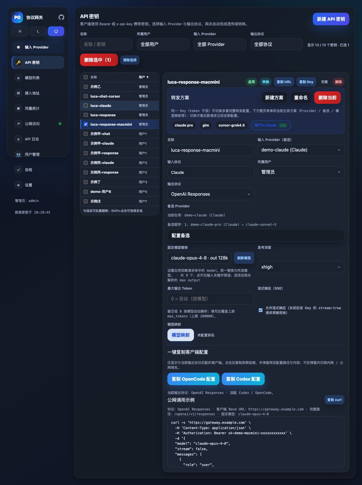
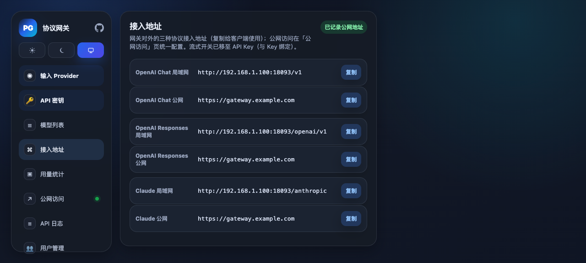
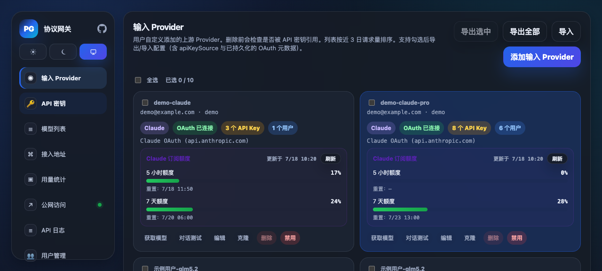
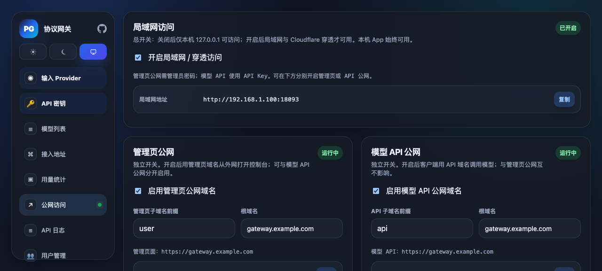
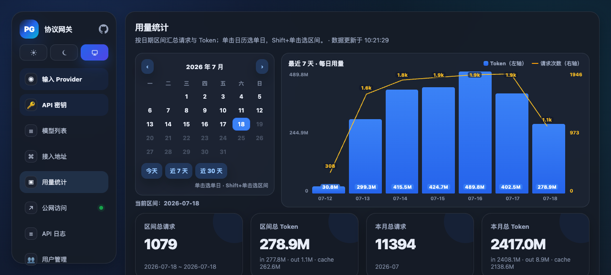
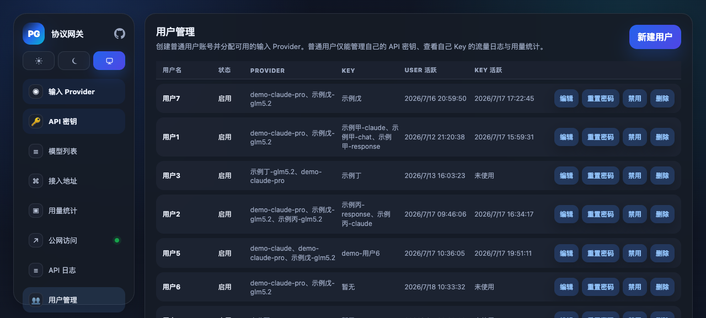
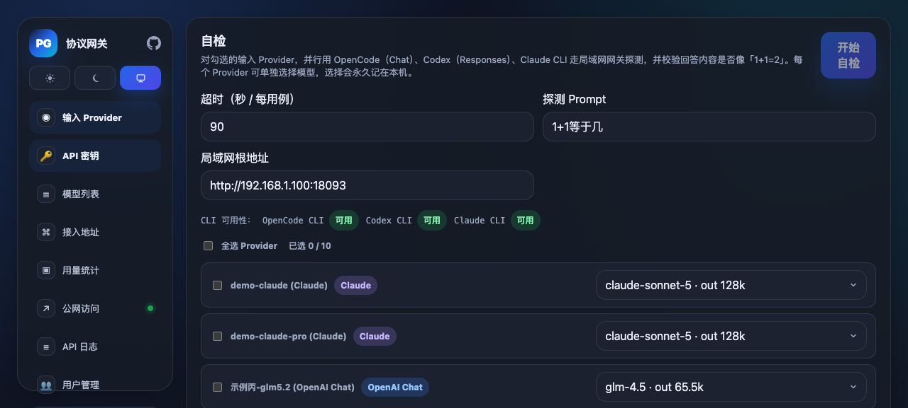

# LLM Protocol Gateway

**一个 macOS 桌面网关：在 OpenAI Chat / OpenAI Responses / Claude 三种协议之间自由互转与透传，
把本地/第三方/官方账号统一收敛成一个可对外访问的 OpenAI 或 Claude 端点。**

面向 Cursor、Codex 等自定义模型客户端，解决"协议对不上、无法跨网络访问、无法控制模型名与
思考深度、单一上游不稳定"等一系列实际痛点。

---

## ✨ 核心特性

### 1. 三协议互转
OpenAI Chat ⇄ OpenAI Responses ⇄ Claude 任意组合：协议相同则透传，协议不同则做**点对点直转**
（不经有损中间层，完整保留工具调用、流式、以及 Claude 的签名 thinking 块）。客户端说什么协议、
上游用什么协议，互不感知。

### 2. 一键公网访问（Cloudflare）
内置 Cloudflare Tunnel：可选随机 `trycloudflare.com` 域名（零配置），或用 Token 绑定你自己的
域名。**让 Cursor / Codex 或其它机器跨网络直接访问你本地的网关**，无需公网 IP、无需自己搭反代。

### 3. 本地也能当"模型提供方"（Bearer 自注册）
Provider 支持 Bearer 令牌接入任意上游；更进一步，提供**机器侧自注册接口**
（`PATCH /__providers/{id}/self-register`，仅用 Provider 级 Bearer 令牌鉴权）：你在本地/内网跑的
模型服务，即使地址会随隧道轮转，也能用脚本自动回填地址，把**本地模型稳定地对外提供出去**。
详见 [Bearer Provider 文档](docs/bearer-provider.md)。

### 4. 同一 Key 多 Provider，异常自动切换
一个对外 API Key 可绑定一条 **Provider 备选链**：主 Provider 出现限流 / 5xx / 鉴权失败 /
连接错误时**自动故障转移**到下一个；前置 Provider 恢复后**自动回切**。后台每 2 分钟对"异常"
Provider 做一次轻量探测，恢复即停，健康 Provider 无额外流量。

### 5. 覆盖模型名与推理深度
模型名、思考（thinking / `reasoning_effort`）深度都支持两种模式：
- **默认值兜底**：客户端没带时，用 Provider/Route 的默认值补齐（比如给 Cursor 的自定义模型补上思考深度）。
- **强制覆盖**：忽略请求体里的模型名 / 思考深度，一律以网关配置为准。

### 6. 多种账号接入
Provider 不止支持 API Key，还支持 **OAuth 账号**直连：
- **Claude 账号**（Claude.ai 订阅，OAuth）
- **OpenAI / ChatGPT 账号**（Codex CLI OAuth）
- **Cursor 账号**（Cursor 订阅）

令牌刷新由网关托管，密钥/令牌永不下发到前端。

### 7. Claude 账号缓存命中优化
针对 Claude（尤其 OAuth 账号）转发，网关会在正确位置**自动注入 `cache_control` 断点**
（工具尾块、system 尾块、倒数第二条 user 消息），保证 Anthropic 的 prompt 缓存能稳定**命中**，
显著降低长会话的费用与延迟——解决了转发/转换过程中缓存断点丢失、命中率骤降的问题。
（实现见 `internal/gateway/claude_oauth_cloak.go`）

---

## 🖼️ 界面预览

> 以下截图均已脱敏（账号邮箱 / 私有域名 / Tunnel Token / 局域网 IP / 真实用户名 / 密钥值等已替换为示例值）。

### API 密钥：同一个 Key，多方案一键切换

一个 Key（token 不变）可保存多套完整转发配置（方案），点选即时切换；每套方案可配置首选
Provider、备选 Provider、模型映射、思考深度等，页面底部可一键复制对应 Agent 客户端配置。



### 三协议接入地址

同一网关对外提供 OpenAI Chat / OpenAI Responses / Claude 三种端点（局域网 + 公网）。



### Provider 管理

支持 Claude / OpenAI / Cursor 账号与 API Key，展示订阅额度、协议、绑定用户。



### 公网访问（Cloudflare）

一键穿透，管理页与模型 API 域名可分别开启。



### 用量统计

按日期区间汇总请求 / Token，含缓存命中率，按 Key / Provider / 模型 维度。



### 用户管理

创建普通用户并分配可用 Provider；普通用户仅能管理自己的 Key 与查看自己的日志/用量。



### 自检

对勾选的 Provider 并行用 OpenCode / Codex / Claude CLI 走网关探测，校验回答是否正确。



---

## 🚀 快速开始

一键启动（编译网关，并在缺失/过期时自动构建 `web/dist`）：

```bash
cd web
npm install
npm run dev
```

- 本地开发 UI：`http://127.0.0.1:5173`（Vite HMR）
- 网关 API / 公网入口 / 管理页：`http://127.0.0.1:18093`

仅起后端：

```bash
go run ./cmd/gateway
# 自定义端口
GATEWAY_ADDR=127.0.0.1:18090 go run ./cmd/gateway
```

> 只跑 `go run ./cmd/gateway` 时，公网管理页依赖网关内的 `web/dist`，需先 `cd web && npm install && npm run build`，
> 否则公网 UI 域名会 404（`npm run dev` / `scripts/ensure-gateway.sh` 会自动构建）。

配置存储：`~/Library/Application Support/llm-protocol-gateway/`（SQLite）。

---

## ☁️ Cloudflare 公网访问

默认关闭；在 UI 开启后可选：

- **随机模式**：`cloudflared tunnel --url http://127.0.0.1:18093`，取输出的 `trycloudflare.com` 地址，无需账号。
- **自有域名模式**：在 Cloudflare Zero Trust 建 Tunnel，为域名添加指向 `http://127.0.0.1:18093`
  的 Public Hostname，把 Tunnel Token 填入 App，网关以 `cloudflared tunnel run --token <token>` 运行。

> Tunnel Token 属敏感信息，当前明文持久化在本地（后续计划接入 Keychain）。

---

## 📚 文档

- [Bearer 令牌 Provider 说明](docs/bearer-provider.md) —— 配置、鉴权、健康探测、故障转移、自注册
- [macOS App](docs/macos-app.md)
- [已知问题 / 踩坑记录](docs/known-issues.md)

---

## 🔌 验证接口

```bash
curl http://127.0.0.1:18093/__health
curl http://127.0.0.1:18093/__state
curl http://127.0.0.1:18093/v1/models

curl -s http://127.0.0.1:18093/v1/chat/completions \
  -H 'Content-Type: application/json' \
  -d '{"model":"gpt-5.5","messages":[{"role":"user","content":"hi"}]}'
```
